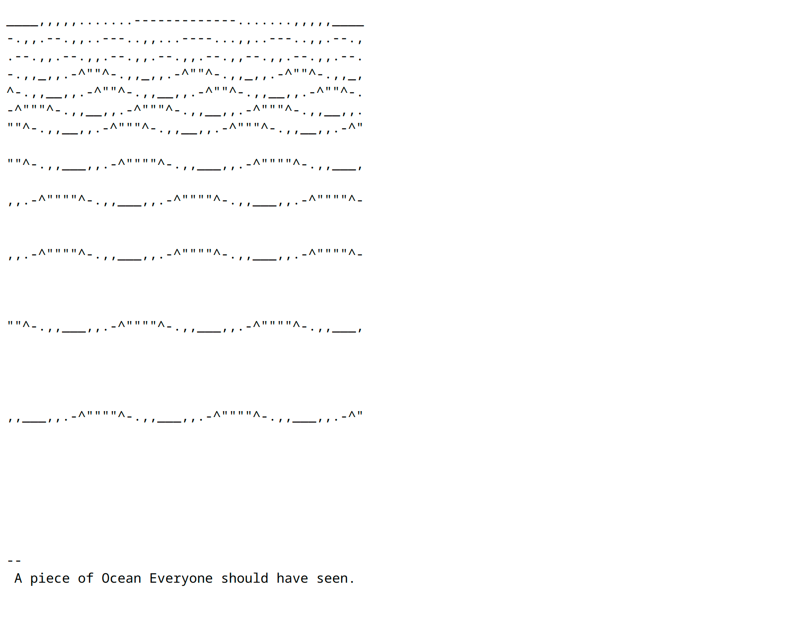

# 37.205.9.239

> "Un morceau d'océan Que tout le monde aurait dû voir."- Le texte sur le site se lit!

Art ASCII amusant. Ainsi soit-il!

  
Remarque:

  
La page manque de balisage HTML classique (enfin, ce n'est tout simplement pas là du tout). Le serveur renvoie de l'ascii brut dans la réponse, sans page html.

  

---

- Lien (orig): [http://37.205.9.239/](http://37.205.9.239/) [SUIVEZ LES LIENS À VOS RISQUES ET PÉRILS.]
- Lien (miroir) [37-205-9-239.www.ffaaee.art](https://37-205-9-239.www.ffaaee.art) [MIEUX VAUT UTILISER UN MIROIR SÉCURISÉ DU SITE WEB.]
- Lien (poste) [www.ffaaee.art/37.205.9.239](https://www.ffaaee.art/37.205.9.239)
